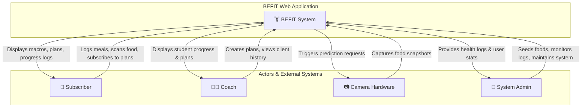
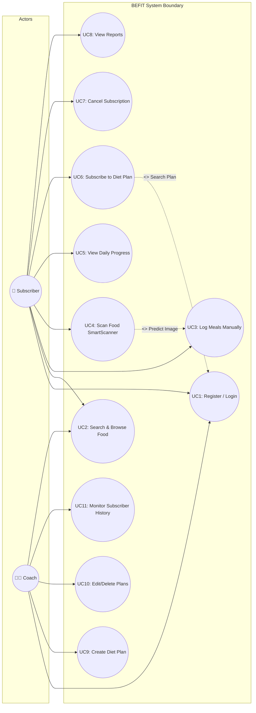
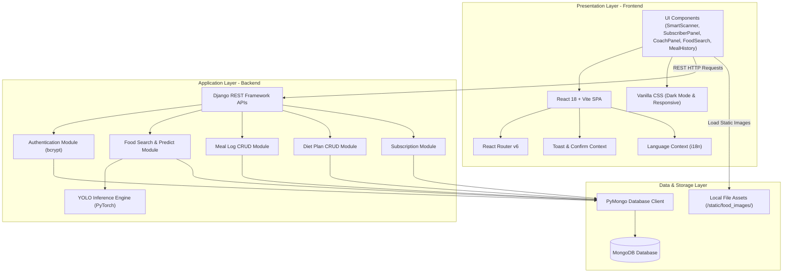
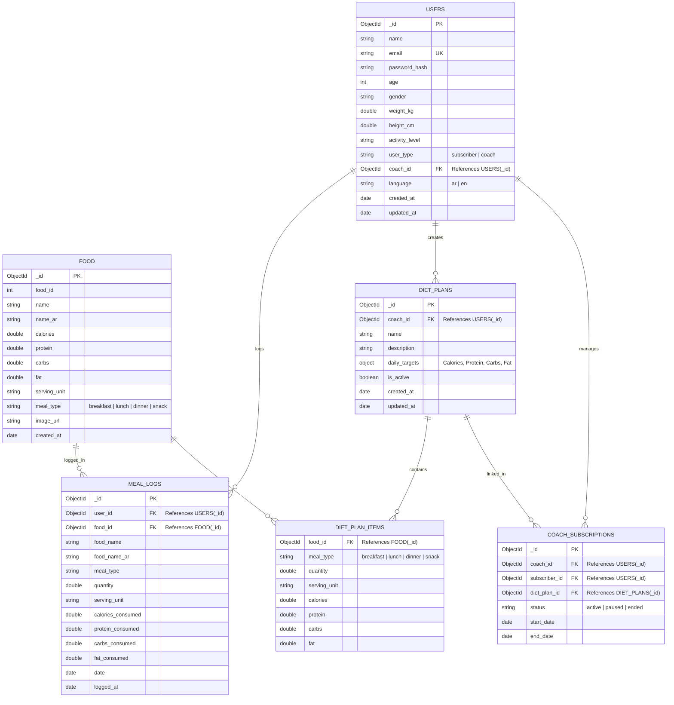
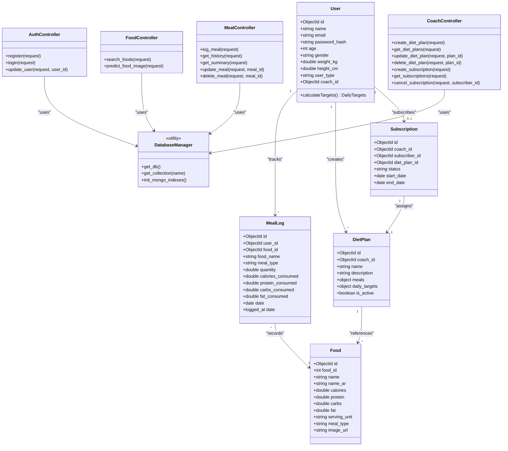
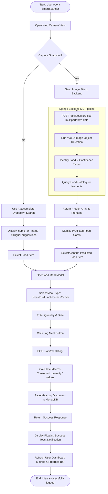

# BEFIT - Graduation Project Documentation Diagrams

هذا المستند يحتوي على الرسوم التخطيطية البرمجية لمشروع التخرج لتطبيق **BEFIT**.
This document contains the official software engineering and database diagrams designed for the **BEFIT** graduation project.

---

## 1. System Context Diagram | مخطط سياق النظام

Shows the high-level boundaries of the BEFIT application and how it communicates with users, coaches, camera hardware, and system administrators.
يوضح الحدود العامة للنظام وتفاعله مع العناصر الخارجية والمستخدمين.



---

## 2. Use Case Diagram | مخطط حالات الاستخدام

Illustrates the roles of the Coach versus the Subscriber and the specific actions they can perform within the system.
يوضح أدوار كل من المشترك والكوتش وحالات الاستخدام الخاصة بكل منهما.



---

## 3. System Architecture Diagram | مخطط هندسة النظام

Displays the three-tier system architecture: React single-page frontend application, Django REST backend framework with YOLO classifier model integration, and MongoDB storage.
يوضح البنية الهندسية ثلاثية الطبقات للتطبيق: الواجهة الأمامية، الخلفية، المعالجة، وقاعدة البيانات.



---

## 4. Entity Relationship Diagram (ERD) | مخطط علاقات الكيانات

Defines the structure of MongoDB collections, field types, primary keys, indexes, and multiplicities matching our database schema.
يوضح هيكل الجداول والروابط والماكروز والخصائص لكل كيان في قاعدة البيانات.



---

## 5. Class Diagram | مخطط الفئات والكيانات البرمجية

Traces the core data models, database management classes, and business logic controller views in our Django app.
يوضح التركيب البرمجي للكود وهيكل الفئات والخصائص والعمليات المتاحة.



---

## 6. Sequence Diagram: Plan Creation & Subscription Flow | مخطط التتابع لإنشاء الخطة والاشتراك

Traces the step-by-step process of a Coach creating a diet plan with food selections, followed by a Subscriber searching for and subscribing to it.
يوضح تسلسل الخطوات البرمجية عند قيام الكوتش بإنشاء خطة غذائية وبحث المشترك عنها والاشتراك بها.

```mermaid
sequenceDiagram
  autonumber
  actor Coach as 👨‍🏫 Coach
  actor Subscriber as 👤 Subscriber
  participant FE as 🖥️ React Frontend
  participant BE as ⚙️ Django Backend API
  database DB as 🗄️ MongoDB

  %% Phase 1: Plan Creation
  note over Coach, DB: Phase 1: Coach Creates a Unique Diet Plan
  Coach->>FE: Open Coach Panel & click "Add Plan"
  FE->>BE: GET /api/foods/search/?query=all (Populates food list)
  BE->>DB: Fetch 66 food items catalog
  DB-->>BE: Return food items
  BE-->>FE: Return foods lists
  Coach->>FE: Select foods, set quantities, name plan (e.g. "Big Ramy Plan")
  FE->>FE: Calculate daily totals (Calories, Protein, Carbs, Fat)
  Coach->>FE: Click "Create Diet Plan"
  FE->>BE: POST /api/diet-plans/ (plan payload)
  activate BE
  BE->>DB: Insert plan document into diet_plans collection
  DB-->>BE: Return inserted plan info
  BE-->>FE: Return success response { "success": true }
  deactivate BE
  FE-->>Coach: Display toast "Plan Created Successfully"

  %% Phase 2: Subscriber Search & Subscription
  note over Subscriber, DB: Phase 2: Subscriber Searches and Subscribes to Plan
  Subscriber->>FE: Open Dashboard (Render Search Plan view)
  Subscriber->>FE: Type "big ramy" (case-insensitive)
  FE->>BE: GET /api/diet-plans/list/
  activate BE
  BE->>DB: Fetch all active plans
  DB-->>BE: Return plans array
  BE-->>FE: Return plans array
  deactivate BE
  FE->>FE: Perform case-insensitive client-side search match (.toLowerCase())
  FE-->>Subscriber: Render "Big Ramy Plan" details & targets
  Subscriber->>FE: Click "Subscribe Now"
  FE->>BE: POST /api/subscriptions/ (subscriber_id, coach_id, diet_plan_id)
  activate BE
  BE->>DB: Insert subscription document (status: 'active')
  BE->>DB: Update subscriber user profile (coach_id)
  DB-->>BE: Success
  BE-->>FE: Return success response { "success": true }
  deactivate BE
  FE->>FE: Save coach_id to localStorage
  FE->>FE: Re-fetch client profile & today's meals
  FE-->>Subscriber: Show Success Toast & Render Active Dashboard Banner
```

---

## 7. Activity Diagram: SmartScanner Food Logging | مخطط النشاط

Flowchart detailing the operation of the SmartScanner camera feature, backend YOLO prediction matching, and logging items.
يوضح تدفق العمليات عند مسح الطعام بالكاميرا الذكية ومعالجة الصورة وتأكيد الإضافة.



---

## 8. Sequence Diagram: SmartScanner ML Detection & Logging | مخطط التتابع للمسح الذكي والتعرف على الأطعمة

Detailed tracing of the message exchanges during camera frame capture, YOLO food classification, macro matching, and database persistence.
يوضح تسلسل التفاعل بين الكاميرا، معالجة YOLO، وجلب العناصر الغذائية وتسجيل الوجبة.

```mermaid
sequenceDiagram
  autonumber
  actor Subscriber as 👤 Subscriber
  participant UI as 🖥️ SmartScanner Component
  participant Context as 🗣️ Language / Toast Context
  participant Camera as 📷 Device Camera API
  participant API as ⚙️ Django REST API (port 8000)
  participant YOLO as 🧠 YOLO Inference Pipeline
  database DB as 🗄️ MongoDB (food_database & meal_logs)

  Subscriber->>UI: Click "SmartScanner" in Navigation
  UI->>Camera: Request camera access permission
  Camera-->>UI: Grant access & display live stream
  Subscriber->>UI: Position food item and click "Capture Image"
  UI->>Camera: Capture image frame
  Camera-->>UI: Return image binary/base64
  UI->>UI: Show processing skeleton spinner
  UI->>API: POST /api/foods/predict/ (multipart/form-data image)
  activate API
  API->>YOLO: Pass image frame to YOLO object detector
  activate YOLO
  YOLO->>YOLO: Run image model inference (shape classification)
  YOLO-->>API: Return prediction name and confidence score (e.g., "Pizza")
  deactivate YOLO
  API->>DB: Query food catalog details by matching name
  DB-->>API: Return food macros (calories, protein, carbs, fat, serving_unit)
  API-->>UI: Return JSON results: { success: true, predictions: [...] }
  deactivate API
  
  UI-->>Subscriber: Display predicted food card (image + name + unit macros)
  Subscriber->>UI: Confirm predicted item & enter quantity + meal type (e.g., lunch)
  Subscriber->>UI: Click "Log Meal"
  UI->>API: POST /api/meals/log/ (user_id, food_id, quantity, meal_type, date)
  activate API
  API->>DB: Insert meal session item into meal_logs collection
  DB-->>API: Return success response
  API-->>UI: Response: { success: true, meal: {...} }
  deactivate API
  UI->>Context: Call toast.success("Meal Added Successfully!")
  Context-->>Subscriber: Show animated success toast notification
  UI->>UI: Trigger Dashboard metrics re-calculation
  UI-->>Subscriber: Navigate back to Dashboard with updated metrics
```

---

## 9. Sequence Diagram: 30-Day Compliance Report Generation | مخطط تتابع تقرير الالتزام لـ 30 يوماً

Depicts how daily meals summary logs are aggregated for the past month, compared with the active plan targets, and prepared for printing.
يوضح كيفية تجميع وجبات آخر 30 يوماً ومقارنتها بأهداف المشترك وحساب معدل الالتزام وتجهيزها للطباعة.

```mermaid
sequenceDiagram
  autonumber
  actor Subscriber as 👤 Subscriber
  participant UI as 🖥️ SubscriberPanel Component
  participant Context as 🗣️ Language Context (i18n)
  participant API as ⚙️ Django REST API (port 8000)
  database DB as 🗄️ MongoDB (meal_logs & diet_plans)

  Subscriber->>UI: Open Subscriber Dashboard
  UI->>API: GET /api/subscriptions/list/?subscriber_id={id}
  activate API
  API->>DB: Fetch active coach subscriptions and assigned diet plan
  DB-->>API: Return subscription (coach info, diet_plan_id)
  API-->>UI: Response
  deactivate API

  UI->>API: GET /api/meals/history/?user_id={id}&start_date={today}&end_date={today}
  activate API
  API->>DB: Fetch all meal_logs matching today's date
  DB-->>API: Return today's meals list
  API-->>UI: Response
  deactivate API
  UI->>UI: Compute daily totals & target percentage compliance
  UI-->>Subscriber: Render Progress Bar and Today's Summary card

  Subscriber->>UI: Click "View Comprehensive Report"
  UI->>UI: Show report loading skeleton spinner
  UI->>API: GET /api/meals/history/?user_id={id}&start_date={today-30d}&end_date={today}
  activate API
  API->>DB: Fetch last 30 days of meal logs
  DB-->>API: Return history array
  API-->>UI: Response
  deactivate API
  
  UI->>UI: Calculate compliance score (days meeting 85-115% calorie targets)
  UI->>UI: Calculate average daily macros (Protein, Carbs, Fat)
  UI->>UI: Calculate total active logged days
  UI-->>Subscriber: Render report modal displaying graphs, macro bars & stats
  
  Subscriber->>UI: Click "Print Report"
  UI->>UI: Trigger window.print() (loads print CSS stylesheet)
  UI-->>Subscriber: Open browser print dialog with formatted PDF preview
```
